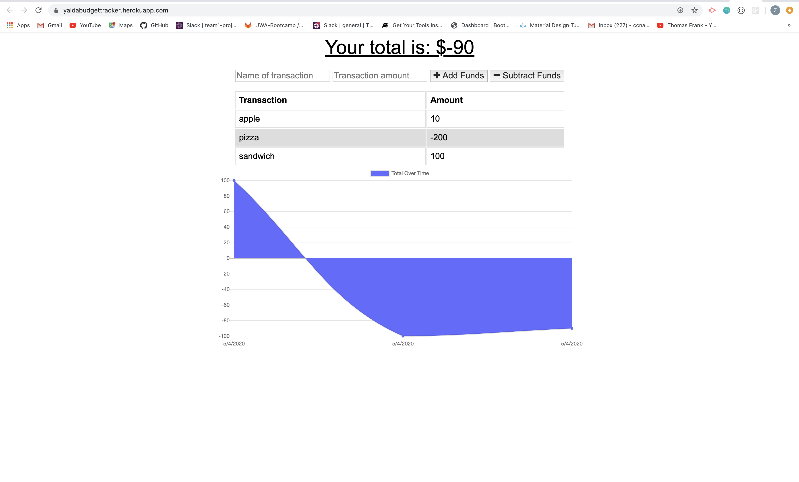

# [Budget-Tracker](https://yaldabudgettracker.herokuapp.com/)

## A downloadable spending tracker application built with  MongoDB allowing offline use

>This application will help you add and subtract funds for items to simply track your spending.


## Table of contents
* [General info](#general-info) 
* [Screenshots](#screenshots) 
* [Installation](#installation) 
* [Usage](#usage)
* [Credits](#credits)
* [Features](#features) 
* [Status](#status) 
* [License](#license) 
* [Contact](#contact)


## General Info
With Budget Tracker you will be able to track your spending and funds. You can also use this application offline.


## Screenshots


 


## Installation

To install : 
* [Visual Code](https://code.visualstudio.com/docs/setup/setup-overview)
* [NodeJS](https://nodejs.org/en/download/)
* [Mongodb](https://docs.mongodb.com/manual/installation/) <br>
For Mac
* [Homebrew](https://brew.sh/)
* [XCode](https://developer.apple.com/xcode/)

To use:
* [Mongoose documents](https://mongoosejs.com/docs/guide.html)


In order to install, first download the files. Then you would open terminal and type ```npm install``` . This will install all the npm packages listed under the dependencies in the package.json.(MySQL, express, express-handlebars, Node) Then you will open  MySQLworkbench and copy the data in schema.sql file in a SQL file. Once you click on the execute button database table is created for you locally. Then you will open terminal again and type the command ``` node server.js```. This will connect the server. Finally you will type ```localhost:8080``` in the browserwindow and use the application. If you would like to make changes to the application code files , you will have to restart the server after each change. To avoid that, you can install nodemon and use the command ```nodemon server.js``` in the terminal so that it will automatically restart the server for you after each change.

## Usage 


To use this application, you can [click here](https://yaldabudgettracker.herokuapp.com/)


## Credits


Initial readme instructions and most of the files provided by [Triologyed](https://www.trilogyed.com/) <br>
Built with [Bootstrap](https://getbootstrap.com/)


## Features

* Feature 1: Easy to navigate design.
* Feature 2: Ability to add an item for funds.
* Feature 3: Ability to subtract an item for expenses.
* Feature 4: Both Online and Offline use.
* Feature 5: graph of total over time changing based on the inputs received.
* deployed with heroku.


To-do list:

*  need to get more comfortable with service-worker file and manifest.
*  UI desing can be improved.


## Status
Project is:  _finished_


## License

MIT license 
Copyright © 2020 Zahra Ali Aghazadeh


## Contact
Email: zahraaliaghazadeh@gmail.com

LinkedIn: [Zahra Ali Aghazadeh](https://www.linkedin.com/in/zahraaliaghazadeh)

feel free to contact me!

